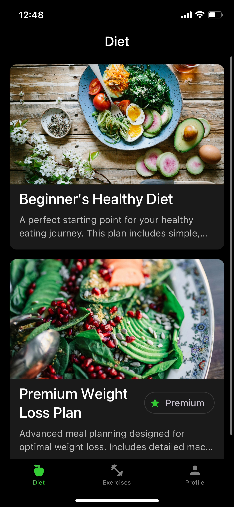
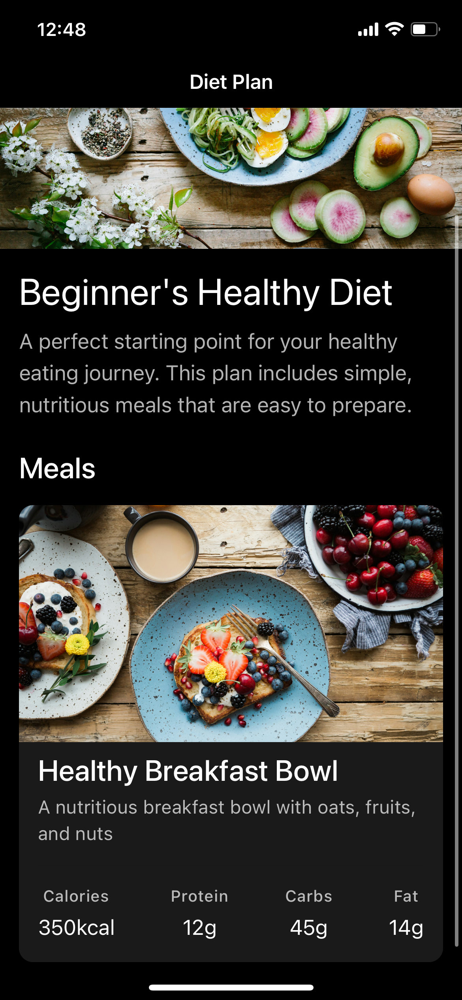
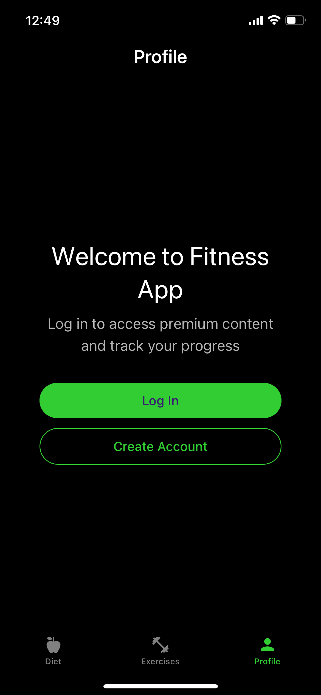
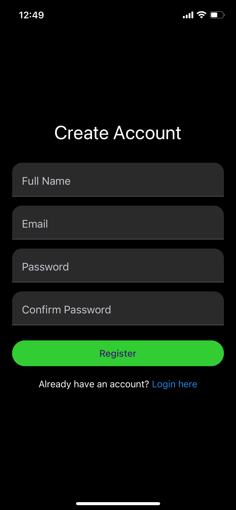
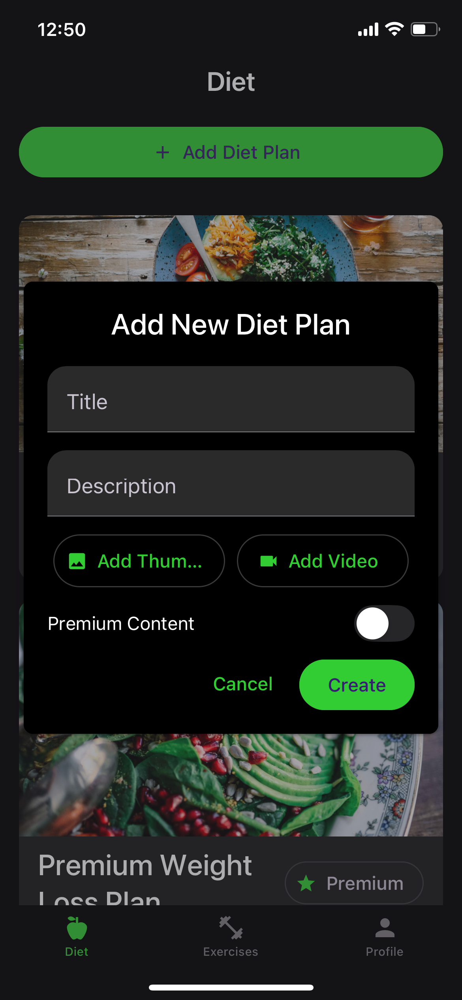

# Femme Fitness

A full-featured mobile fitness application delivering personalized workout plans, diet programs, and personal training management. Built with React Native and Expo for cross-platform deployment (iOS/Android).

## Key Features

- **Multi-tier Content System** — Freemium model with free and premium workout/diet plans, integrated with in-app purchases via RevenueCat
- **Personal Training Module** — Custom training plan creation and session tracking with progress completion logic
- **Rich Media Support** — Video content delivery for exercises and training sessions with thumbnail previews
- **Role-based Access Control** — Admin dashboard for user management, premium tier assignment, and content administration
- **Secure Authentication** — JWT-based auth with email/password, password reset, and Row Level Security policies

## Technical Architecture

### Frontend
- **React Native** (v0.76) with **TypeScript** — Type-safe mobile development
- **Expo** (SDK 52) + **Expo Router** — File-based navigation with deep linking support
- **React Native Paper** — Material Design component library
- **Recoil** — Atomic state management for auth, user preferences, and UI state

### Backend
- **Supabase** — PostgreSQL database with real-time subscriptions
- **Row Level Security (RLS)** — Database-level access control ensuring users only access authorized data
- **PostgreSQL Functions** — Server-side logic for user profile automation and admin operations

### Key Integrations
- **RevenueCat** (`react-native-purchases`) — In-app purchase management for premium subscriptions
- **Expo Image Picker** — Media upload for user-generated content

## Database Schema Highlights

```sql
-- Multi-tenant security with RLS
CREATE TABLE user_profiles (
  id UUID REFERENCES auth.users(id) PRIMARY KEY,
  is_premium BOOLEAN DEFAULT FALSE,
  is_admin BOOLEAN DEFAULT FALSE
);

-- Premium content gating
CREATE TABLE workout_plans (
  id UUID PRIMARY KEY DEFAULT gen_random_uuid(),
  title TEXT NOT NULL,
  is_premium BOOLEAN DEFAULT FALSE,
  video_url TEXT,
  thumbnail_url TEXT
);

-- Personal training with session tracking
CREATE TABLE personal_training_sessions (
  id UUID PRIMARY KEY,
  plan_id UUID REFERENCES personal_training_plans(id),
  day_number INTEGER,
  is_completed BOOLEAN DEFAULT FALSE,
  video_url TEXT
);
```

## Project Structure

```
Femme/
├── app/                     # Expo Router routes
│   ├── (auth)/             # Auth screens (login, register)
│   ├── (tabs)/             # Main app: diet, exercises, training, profile
│   └── (modals)/           # Full-screen modals for plan details
├── src/
│   ├── components/         # UI components (admin, diet, exercise, training)
│   ├── services/api/       # Domain-specific API clients
│   │   ├── auth.ts         # Authentication flows
│   │   ├── diet.ts         # Diet plan CRUD
│   │   ├── exercise.ts     # Workout plan CRUD
│   │   ├── training.ts     # Personal training management
│   │   └── users.ts        # User/admin operations
│   ├── services/supabase/  # Supabase client & config
│   ├── store/atoms/        # Recoil state atoms
│   ├── types/              # TypeScript interfaces
│   └── theme/              # UI theming configuration
└── sql/                    # Database migrations & RLS policies
```

## Notable Implementation Details

**Premium Content Gating:** Content access is enforced at both the application layer (UI conditionals) and database layer (RLS policies querying `user_profiles.is_premium`).

**Admin User Management:** Custom PostgreSQL functions (`set_user_premium`, `set_user_admin`) enable secure role elevation without direct table access, triggered via admin UI.

**Training Progress Tracking:** Personal training sessions track completion state per-day, allowing users to follow structured multi-week programs with persistence across sessions.

## Development

```bash
# Install dependencies
npm install

# Start dev server
npm start

# Platform-specific
npm run ios
npm run android

# Type checking & linting
npm run type-check
npm run lint
```

## Screenshots

<p align="center">
  
  
  
</p>
<p align="center">
  
  
  
</p>

## License

MIT
